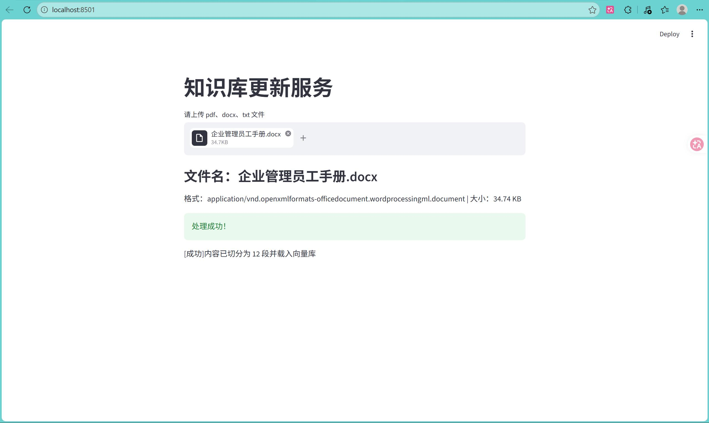
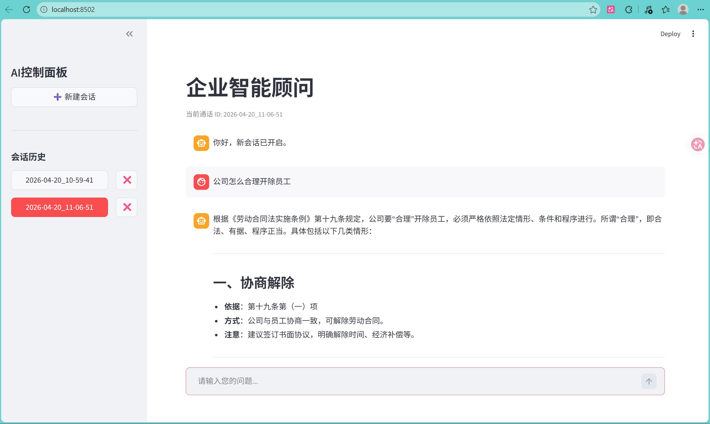

# 🏢 企业智能顾问 RAG 系统

<div align="center">
  
  
  
  
  
</div>

<br>

一款基于 RAG（检索增强生成）的企业智能顾问系统，支持上传 PDF/Word/TXT 外部文件或企业内部文档构建知识库，结合通义千问大模型实现精准的企业问题问答，同时支持多会话管理、对话历史持久化。

## 📋 功能特性
- 📄 **多格式文件解析**：支持 PDF、DOCX、TXT 格式文件上传，自动提取文本内容；
- 🔍 **智能检索增强**：基于 Chroma 向量库检索相关企业文档片段，精准回答问题；
- 💬 **多会话管理**：支持新建/删除会话，对话历史本地持久化存储；
- 🚫 **重复内容过滤**：基于 MD5 校验，避免重复上传相同内容到知识库；
- 🎨 **友好交互界面**：Streamlit 搭建的可视化界面，操作简单易上手；
- ⚡ **流式输出回答**：AI 回答实时流式展示，提升交互体验。

## 🚀 快速开始

### 1. 环境准备
- Python 3.10+
- 阿里云 DashScope 通义千问 API 密钥（需自行申请：[阿里云百炼](https://dashscope.console.aliyun.com/)）

### 2. API 密钥配置（必做！一次配置，永久生效）
#### Windows 系统配置步骤
1. 右键桌面「此电脑」→ 选择「属性」；
2. 点击左侧「高级系统设置」→ 弹出「系统属性」窗口，切换到「高级」标签；
3. 点击「环境变量」→ 在「用户变量」区域（仅当前用户生效，推荐）点击「新建」；
4. 「变量名」输入：`DASHSCOPE_API_KEY`（必须完全一致，大小写敏感）；
5. 「变量值」输入：你的阿里云通义千问 API 密钥（从阿里云百炼控制台获取）；
6. 点击「确定」保存所有窗口，**重启你的终端/IDE**（如 PyCharm、VS Code）；
7. 验证：打开新终端，输入 `echo %DASHSCOPE_API_KEY%`，能看到密钥则配置成功。

#### Mac/Linux 系统配置步骤
1. 打开终端（Terminal）；
2. 编辑环境变量配置文件（根据你的 Shell 选择，Mac 新版默认 zsh）：
   - zsh 用户：`vi ~/.zshrc`
   - bash 用户：`vi ~/.bashrc`
3. 在文件末尾新增一行（替换为你的密钥）：
   ```bash
   export DASHSCOPE_API_KEY=你的阿里云通义千问API密钥
   ```
### 3. 安装依赖
```bash
# 克隆仓库
git clone https://github.com/你的用户名/RAG-Langchain.git
cd RAG-Langchain

# 安装项目所有依赖
pip install -r requirements.txt 
```
### 4. 项目运行
#### 启动文件上传界面（构建知识库）
上传相关文档（PDF/Word/TXT），系统自动解析并入库
单次只能上传一份文件，若有多份文件需上传，请上传多次。
```bash
streamlit run app_file_uploader.py
```


#### 启动问答界面
```bash
streamlit run app_qa.py
```


## 📁 项目结构
```
RAG-Langchain/  # 项目文件夹
├── images/                      # 项目截图目录
│   ├── .gitkeep                 # 空目录占位文件
│   ├── 上传文件到数据库.jpg      # 文件上传界面截图
│   └── 智能顾问运行示例.jpg      # 问答界面截图
├── .gitignore                   # Git忽略规则
├── LICENSE                      # 许可证文件
├── README.md                    # 项目说明
├── app_file_uploader.py         # Streamlit文件上传界面（核心代码）
├── app_qa.py                    # Streamlit问答界面
├── config_data.py               # 全局配置（模型、向量库、分片参数）
├── file_history_store.py        # 对话历史文件存储
├── knowledge_base.py            # 知识库核心（文本分片、MD5去重、向量入库）
├── rag.py                       # RAG问答链（提示词、对话历史、模型调用）
├── requirements.txt             # 依赖清单
└── vector_stores.py             # Chroma向量库封装（检索器）
```
## 🧩 核心流程
1. 文件上传：用户上传企业文档 → app_file_uploader.py 解析文本。  
2. 文本处理：文本分片 → MD5 去重 → 调用 knowledge_base.py 向量入库（Chroma）。  
3. 问答流程：用户在 app_qa.py 提问 → vector_stores.py 检索相关文档 → rag.py 结合对话历史调用通义千问 → 流式返回结果。  

## ⚠️ 注意事项
1. 确保 API 密钥配置后重启终端 / IDE，否则项目无法读取环境变量。  
2. 向量库默认存储在本地 chroma_db/ 目录，清空该目录可重置知识库。  
3. 单次上传文件建议不超过 100MB，避免解析耗时过长。  
4. md5.text 记录已上传文件的 MD5，删除后重复上传检测失效。  
